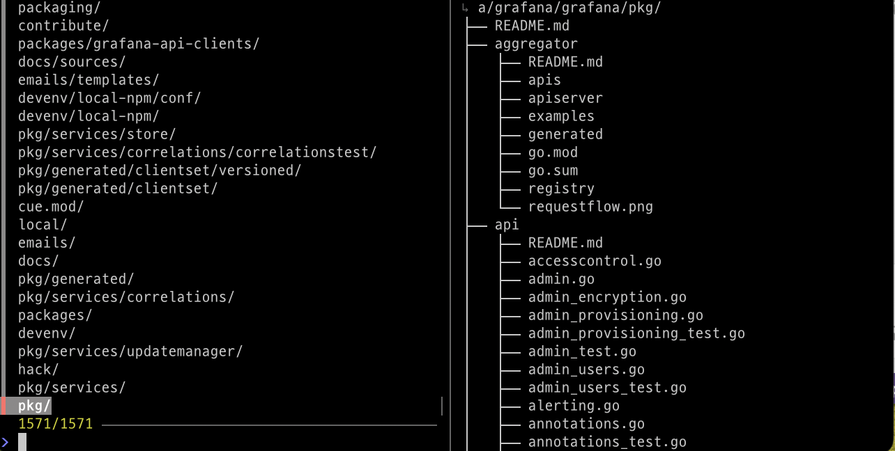

# fzfw

A reusable directory and file selector built on top of `fzf` and `fd`. Quickly navigate and select directories or files with an interactive fuzzy finder.



## Features

- Interactive fuzzy search for directories and files
- Preview pane showing directory contents or file previews
- Configurable search depth
- Excludes common build/dependency directories (node_modules, .git, etc.)
- Supports both directory-only and file+directory modes

## Requirements

- `fd` - A simple, fast and user-friendly alternative to `find`
- `fzf` - A command-line fuzzy finder
- Optional: `bat` (for syntax-highlighted file previews)
- Optional: `tree` (for better directory previews)

## Installation

1. Make the script executable:
   ```bash
   chmod +x fzfw
   ```

2. Add to your PATH (optional):
   ```bash
   # Add to ~/.bashrc or ~/.zshrc
   export PATH="$PATH:/path/to/fzfw"
   ```

## Usage

```bash
fzfw [OPTIONS] [search_path]
```

### Options

- `-d max_depth` - Set maximum search depth (default: 4)
- `-f` - Include files in selection (default: directories only)
- `-v` - Verbose mode (show informational messages)

### Examples

```bash
# Search directories in current directory
fzfw

# Search directories in a specific path
fzfw ~/projects

# Include files in search
fzfw -f

# Set custom max depth
fzfw -d 6 ~/projects

# Combine options
fzfw -f -d 3 -v ~/projects
```

## Output

The selected path is printed to stdout as an absolute path. You can use it in scripts or pipe it to other commands:

```bash
# Open selected directory in editor
cd $(fzfw)

# Use in a script
SELECTED=$(fzfw -f)
if [ -n "$SELECTED" ]; then
    echo "Selected: $SELECTED"
fi
```

## Aliases

You can create aliases for quick navigation:

```bash
# Add to ~/.bashrc or ~/.zshrc

# Quick navigation from home directory
alias fzcd='cd $(fzfw ~)'

# Quick navigation from current directory
alias fz='cd $(fzfw)'

# Quick navigation with files included
alias fzf='cd $(fzfw -f)'
```

After adding aliases, reload your shell configuration:
```bash
source ~/.bashrc  # or source ~/.zshrc
```
